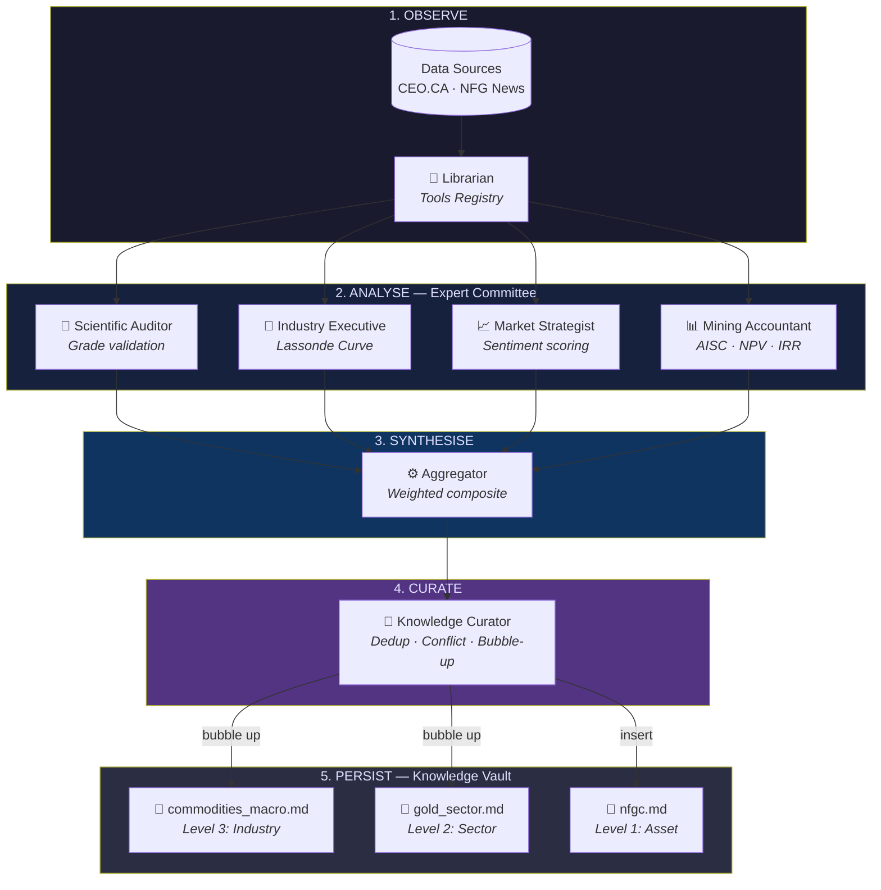

# MarketSage — Architecture

## System Overview

MarketSage is a multi-agent investment intelligence system that maintains
a self-evolving **Hierarchical Markdown Knowledge Vault**.



## Vault File Hierarchy

```
vault/
├── _index.json
├── _reports/                          ← JSON audit trail
│   └── NFGC_20260424_160000.json
└── commodities/
    ├── commodities_macro.md           ← Level 3: Industry
    └── precious_metals/
        └── gold/
            ├── gold_sector.md         ← Level 2: Sector
            └── assets/
                └── nfgc.md            ← Level 1: Asset
```

## Learning Loop (Update Workflow)

| Step | Agent | Action |
|------|-------|--------|
| 1. Observe | Librarian | Loads scraped spiels + articles |
| 2. Analyse | Expert Committee | Generates `ExpertOpinion` objects |
| 3. Synthesise | Aggregator | Merges into `StateReport` |
| 4. Curate | Knowledge Curator | Dedup → Conflict check → Bubble-up → Write |
| 5. Persist | Curator | Rewrites Markdown vault files |
